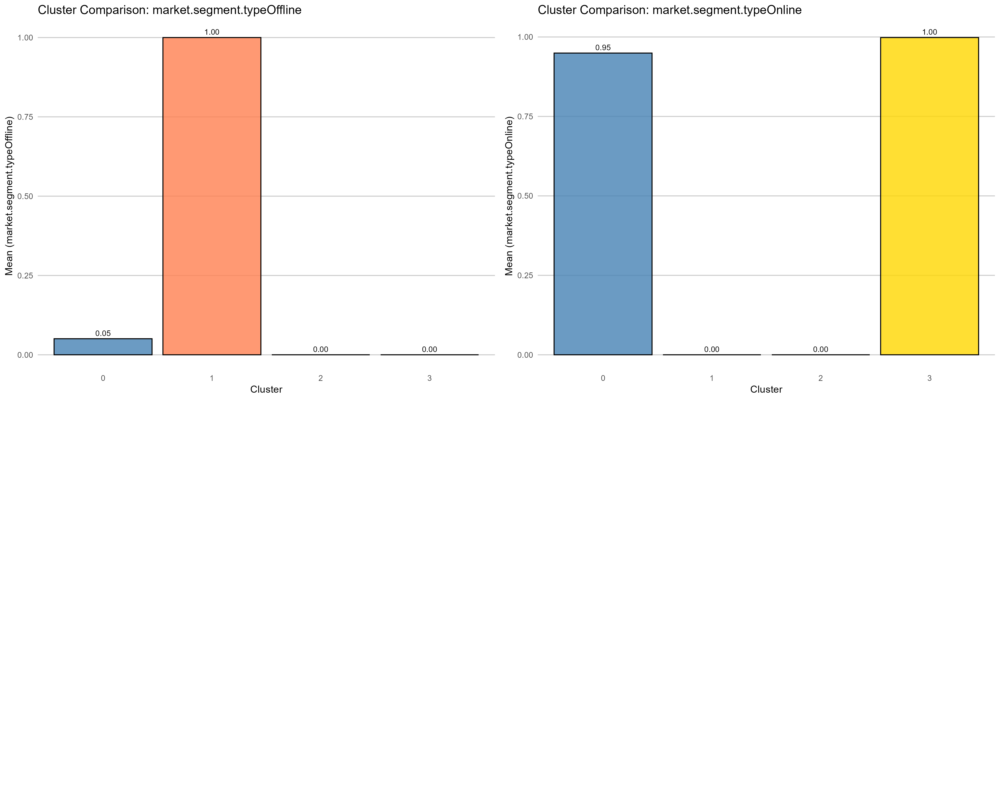

# Αναφορά Ομαδοποίησης Ακυρώσεων Ξενοδοχείων

## 1. Επισκόπηση Έργου
Ο στόχος αυτού του έργου είναι η ανάλυση δεδομένων κρατήσεων ξενοδοχείων για τον εντοπισμό διακριτών τμημάτων πελατών (clusters) με βάση τις συμπεριφορές και τα χαρακτηριστικά των κρατήσεών τους. Κατανοώντας αυτά τα τμήματα, στοχεύουμε να αποκτήσουμε γνώσεις σχετικά με τα μοτίβα ακυρώσεων και πιθανές στρατηγικές για τη διαχείριση εσόδων.

## 2. Μεθοδολογία

### Μηχανική Χαρακτηριστικών (Feature Engineering)
Παραγάγαμε αρκετά βασικά χαρακτηριστικά για την καλύτερη αποτύπωση της συμπεριφοράς των πελατών:
- **Μήνας Άφιξης (Arrival Month)**: Υπολογίστηκε για την αποτύπωση της εποχικότητας.
- **Σύνολο Επισκεπτών (Total Guests)**: Άθροισμα ενηλίκων και παιδιών.
- **Είναι Οικογένεια (Is_Family)**: Δυαδικός δείκτης για κρατήσεις με παιδιά.
- **Σύνολο Διανυκτερεύσεων (Total Nights)**: Άθροισμα διανυκτερεύσεων καθημερινής και σαββατοκύριακου.
- **Αναλογία Ακυρώσεων (Cancellation Ratio)**: Μια εξομαλυμένη αναλογία προηγούμενων ακυρώσεων για επαναλαμβανόμενους πελάτες.
- **Τιμή ανά Άτομο (Price per Person)**: Μέση τιμή διαιρεμένη με το σύνολο των επισκεπτών.

### Προεπεξεργασία (Preprocessing)
- **Καθαρισμός Δεδομένων**: Χειρισμός μη έγκυρων ημερομηνιών και ελλιπών τιμών.
- **Ομαδοποίηση Τιμών (Binning)**: Ομαδοποίηση σπάνιων τιμών σε χαρακτηριστικά όπως `number.of.children`, `Total_Guests` και `Total_Nights` για μείωση του θορύβου.
- **Κωδικοποίηση (Encoding)**: Εφαρμογή one-hot encoding σε κατηγορικές μεταβλητές (`market.segment.type`).
- **Κλιμάκωση (Scaling)**: Κανονικοποίηση αριθμητικών χαρακτηριστικών στο εύρος [-1, 1] για να διασφαλιστεί η ίση συμβολή στους υπολογισμούς αποστάσεων.

### Αλγόριθμοι Ομαδοποίησης (Clustering)
Χρησιμοποιήσαμε δύο κύριους αλγόριθμους ομαδοποίησης:
- **K-Means**: Ένας αλγόριθμος βασισμένος σε κεντροειδή, αποδοτικός για μεγάλα σύνολα δεδομένων.
- **Ιεραρχική Ομαδοποίηση (Hierarchical Clustering)**: Χρησιμοποιήθηκε σε υποσύνολο δεδομένων για την επικύρωση της δομής και τον καθορισμό του βέλτιστου αριθμού ομάδων.

## 3. Ανάλυση & Βελτιστοποίηση

### Καθορισμός Βέλτιστου k
Αξιολογήσαμε τον αριθμό των ομάδων (k) χρησιμοποιώντας Silhouette Score, Elbow Method, NMI και ARI.
- Η αρχική ανάλυση πρότεινε k=3, αλλά περαιτέρω βελτιστοποίηση αποκάλυψε μια ισχυρότερη δομή στο **k=4**.

### Απαλοιφή Χαρακτηριστικών (Feature Elimination)
Για τη βελτίωση της ποιότητας των ομάδων, αφαιρέσαμε επαναληπτικά τα θορυβώδη χαρακτηριστικά:
- Αφαιρέθηκαν τα `room.type` και `type.of.meal` (κατηγορικά).
- Αφαιρέθηκαν τα `Reservation_Weekday` και `Arrival_Year` (χρονικός θόρυβος).
- Αφαιρέθηκε το `Arrival_Month` καθώς έδειξε μικρή διακύμανση μεταξύ των ομάδων.

**Τελικά Αποτελέσματα (k=4):**
- **Silhouette Score**: ~0.49 (Υψηλή ποιότητα)
- **NMI / ARI**: > 0.97 (Εξαιρετική συμφωνία μεταξύ K-Means και Ιεραρχικής)

## 4. Προφίλ Ομάδων (Cluster Profiles)

Με βάση την τελική ομαδοποίηση, εντοπίσαμε 4 διακριτά προφίλ πελατών:

### Cluster 0: Τυπικά Online Ζευγάρια
- **Προφίλ**: Ζευγάρια που ταξιδεύουν για αναψυχή.
- **Βασικά Χαρακτηριστικά**: 2 ενήλικες, 0 παιδιά, υψηλή τιμή ανά άτομο.
- **Κανάλι Κράτησης**: Αποκλειστικά **Online**.
- **Ρίσκο**: Υψηλό ποσοστό ακύρωσης (~37%).

### Cluster 1: Offline / Έγκαιροι Προγραμματιστές (Early Birds)
- **Προφίλ**: Ταξιδιώτες μεγαλύτερης ηλικίας ή γκρουπ που προγραμματίζουν πολύ νωρίτερα.
- **Βασικά Χαρακτηριστικά**: Μεγαλύτερος **Χρόνος Προετοιμασίας (Lead Time)**, χαμηλότερη μέση τιμή.
- **Κανάλι Κράτησης**: **Offline** (Ταξιδιωτικοί Πράκτορες/Τηλέφωνο).
- **Ρίσκο**: Μεσαίο-Υψηλό ποσοστό ακύρωσης (~30%).

### Cluster 2: Premium Οικογένειες
- **Προφίλ**: Οικογένειες σε διακοπές.
- **Βασικά Χαρακτηριστικά**: Παρουσία **παιδιών**, υψηλότερη συνολική τιμή, τα περισσότερα ειδικά αιτήματα.
- **Κανάλι Κράτησης**: **Online**.
- **Ρίσκο**: Υψηλότερο ποσοστό ακύρωσης (~40%) λόγω υψηλού κόστους και πολυπλοκότητας του οικογενειακού ταξιδιού.

### Cluster 3: Πιστοί Εταιρικοί Πελάτες (Loyal Corporate)
- **Προφίλ**: Επαγγελματίες ταξιδιώτες και συχνοί επισκέπτες.
- **Βασικά Χαρακτηριστικά**: **Επαναλαμβανόμενοι** επισκέπτες, ιστορικό μη ακυρώσεων, ανάγκη για πάρκινγκ.
- **Κανάλι Κράτησης**: **Corporate**, Aviation, Complementary.
- **Ρίσκο**: Χαμηλότερο ποσοστό ακύρωσης (~11%).

## 5. Οπτικοποιήσεις

### Κατανομές Χαρακτηριστικών

### Συγκρίσεις Ομάδων

### Θερμικός Χάρτης Ομάδων (Heatmap)

### Ποσοστά Ακυρώσεων

## 6. Συμπέρασμα
Η ανάλυση τμηματοποίησε επιτυχώς τους επισκέπτες του ξενοδοχείου σε τέσσερις αξιοποιήσιμες ομάδες. Το τμήμα "Πιστοί Εταιρικοί Πελάτες" παρέχει μια σταθερή βάση εσόδων με χαμηλό ρίσκο, ενώ τα τμήματα "Premium Οικογένειες" και "Τυπικά Online Ζευγάρια" παράγουν υψηλά έσοδα αλλά συνοδεύονται από σημαντικούς κινδύνους ακύρωσης. Στρατηγικές όπως μη επιστρεπτέες τιμές ή στοχευμένες πολιτικές προκαταβολών θα μπορούσαν να βοηθήσουν στον μετριασμό αυτών των κινδύνων για τα τμήματα με υψηλά ποσοστά ακύρωσης.
