# Project I - Clustering

Δημοσθένης Παναγιώτης Γκοντόλιας (ΑΜ: 3220031)

## 1. Επισκόπηση Εργασίας
Ο στόχος αυτής της εργασίας είναι η ανάλυση δεδομένων κρατήσεων ξενοδοχείων για τον εντοπισμό διακριτών clusters πελατών, με βάση τις συμπεριφορές και τα χαρακτηριστικά των κρατήσεών τους. Κατανοώντας αυτά τα τμήματα, στοχεύουμε να αποκτήσουμε γνώσεις σχετικά με ενδεχόμενα μοτίβα ακυρώσεων.

## 2. Μεθοδολογία

### Feature Engineering
Παραγάγαμε αρκετά βασικά χαρακτηριστικά για την καλύτερη αποτύπωση της συμπεριφοράς των πελατών:
- **Arrival Month**: Υπολογίστηκε για την αποτύπωση της εποχικότητας.
- **Total Guests**: Άθροισμα ενηλίκων και παιδιών.
- **Is Family**: Binary feature για κρατήσεις με παιδιά.
- **Total Nights**: Άθροισμα διανυκτερεύσεων καθημερινών και σαββατοκύριακων.
- **Cancellation Ratio**: Μια αναλογία προηγούμενων ακυρώσεων για επαναλαμβανόμενους πελάτες με εξομάλυνση Laplace.
- **Price per Person**: Μέση τιμή διαιρεμένη με το σύνολο των επισκεπτών.
- **Meal Type & Room Type** & **Market Segment**:Αφαιρέθηκαν οι μεταβλητές αυτές, οπου η κάθεμια είχε Mi κατηγορικές τιμές και δημιουργήθηκαν Mi δυαδικές μεταβλητές για τον τύπο γεύματος και δωματίου, σύμφωνα με τον παρακάτω τρόπο:
    - **Encoding**: Εφαρμογή one-hot encoding σε κατηγορικές μεταβλητές (`market.segment.type`, `room.type`, `type.of.meal`) για τους λόγους ότι οι τιμές της ειναι strings και δεν υπάρχει η έννοια της απόστασης. Όμως και ως αριθμητικές τιμές να τις αντιπροσωπεύσουμε, πάλι δεν έχει νόημα η ευκλέιδια απόσταση πχ να μην θεωρησει οτι το 2 ειναι πιο κοντα στο 1 απο το 3.
    - **Room Type**: `room.type_Room_Type 2` έως `room.type_Room_Type 7`
    - **Meal Type**: `type.of.meal_Meal Plan 2` έως `type.of.meal_Meal Plan 3`
    - **Market Segment**: `market.segment.type_Complementary`, `market.segment.type_Corporate`, `market.segment.type_Offline`, `market.segment.type_Online`
- **Drop First**: Ορισμός του `drop_first=True` για να αποφύγουμε το dummy variable trap. Για αυτόν τον λόγο δεν έχουν χρησιμοποιηθεί `room.type_Room_Type 1`, `type.of.meal_Meal Plan 1`, `market.segment.type_Aviation`.

### Preprocessing
- **Data Cleaning**: Χειρισμός infinite values με μετατροπή σε `NA`.Συμπλήρωση ελλειπουσών τιμών `NA` με τον μέσο όρο `mean` της κάθε στήλης.
- **Binning**: Ομαδοποίηση σπάνιων τιμών σε χαρακτηριστικά όπως `number.of.children`, `Total_Guests` και `Total_Nights` για μείωση του θορύβου:
    #### Μεταβλητές με Binning:
    1. **number.of.children**: 0, 1+ (αντί για 0, 1, 2, 3, κλπ)
    2. **number.of.weekend.nights**: 0, 1, 2, 3+
    3. **number.of.week.nights**: Κανονικά ως το 5, μετά 6+
    4. **P.C (Previous Cancellations)**: 0, 1+
    5. **P.not.C (Previous Non-Cancellations)**: 0, 1+
    6. **Total_Guests**: 1, 2, 3+
    - Όσα είναι 0 γίνονται 1 (διόρθωση)
    7. **Total_Nights**: Κανονικά ως το 7, μετά 8+

- **Scaling**: Κανονικοποίηση αριθμητικών χαρακτηριστικών στο εύρος [0, 1] για να διασφαλιστεί η ίση συμβολή στους υπολογισμούς αποστάσεων, αφού υπάρχουν αριθμητικές τιμές που είναι πολύ μεγαλύτερες απο τις άλλες. Έτσι, δεν θα δωθεί περισσότερη βαρύτητα σε μια μεταβλητή λόγω των μεγάλων τιμών. 
    - Παραδειγμα, μια παρατηρηση με lead.time=100 & total.guests=2 θα είναι πιο κοντά στην παρατήρηση με lead.time=100 & total.guests=5, παρά την παρατήρηση με lead.time=105 & total.guests=2.

### Κατανομές Χαρακτηριστικών
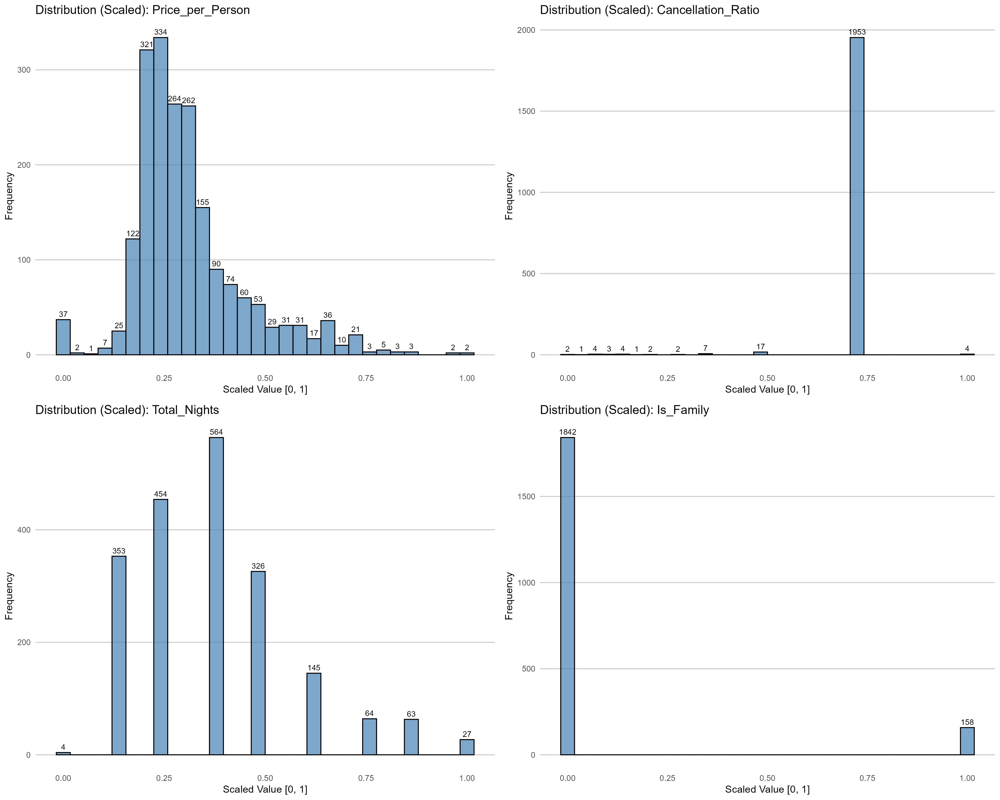
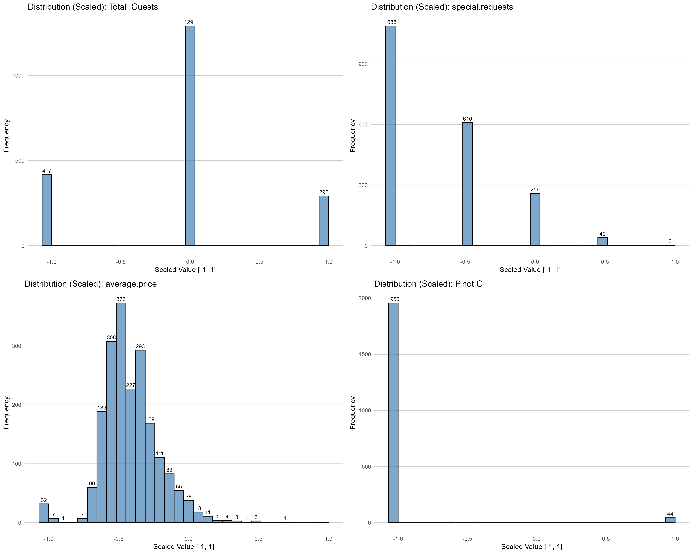
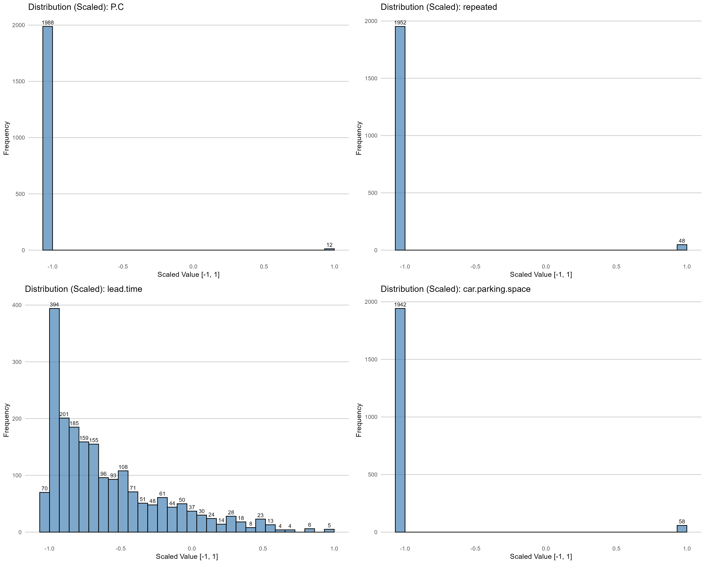
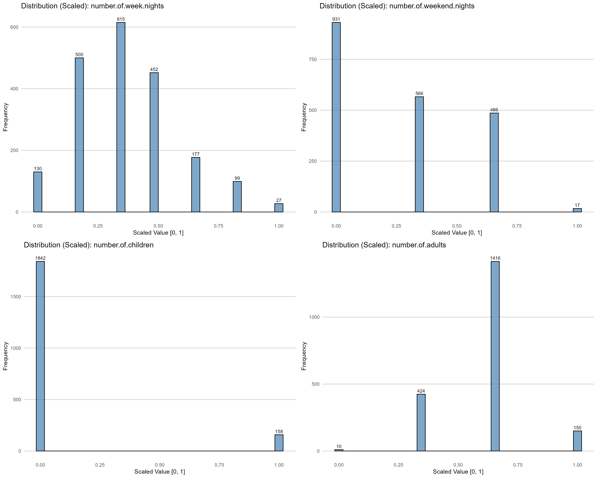

### Κατανομή Market Segment
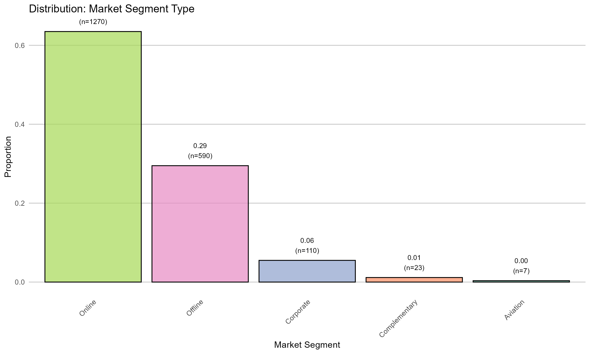

### Clustering
Χρησιμοποιήσαμε δύο κύριους αλγόριθμους clustering για να εξασφαλίσουμε την εγκυρότητα των αποτελεσμάτων:

1. **K-Means Clustering**:
   - **Λειτουργία**: Ένας επαναληπτικός αλγόριθμος που χωρίζει τα δεδομένα σε $k$ ομάδες, ελαχιστοποιώντας την απόσταση των σημείων από το κέντρο της ομάδας τους (centroid).
   - **Παράμετροι**:
     - `centers = k`: Ο αριθμός των ομάδων που δοκιμάσαμε (από 2 έως 10).
     - `nstart = 10`: Ο αλγόριθμος έτρεξε 10 φορές με τυχαία αρχικά κέντρα για να αποφύγουμε τοπικά ελάχιστα και να διασφαλίσουμε τη σταθερότητα της λύσης.
   - **Απόσταση**: Ευκλείδεια απόσταση.

2. **Hierarchical Clustering**:
   - **Λειτουργία**: Κατασκευάζει μια ιεραρχία ομάδων συγχωνεύοντας σταδιακά τα πιο κοντινά σημεία.
   - **Linkage**: `ward.D2`. Η μέθοδος Ward ελαχιστοποιεί τη διακύμανση μέσα στις ομάδες κατά τη συγχώνευση, οδηγώντας σε συμπαγείς και σφαιρικές ομάδες, παρόμοιες με αυτές του K-Means.
   - **Απόσταση**: Ευκλείδεια απόσταση.

## 3. Ανάλυση & Βελτιστοποίηση

### Καθορισμός Βέλτιστου k
Αξιολογήσαμε τον αριθμό των ομάδων k χρησιμοποιώντας Silhouette Score, Elbow Method, NMI και ARI.
- Η αρχική ανάλυση πρότεινε k=3, αλλά περαιτέρω βελτιστοποίηση αποκάλυψε μια ισχυρότερη δομή στο **k=4**.

### Feature Elimination (Stepwise Process)
Η διαδικασία επιλογής χαρακτηριστικών έγινε βηματικά (stepwise), αφαιρώντας μεταβλητές που πρόσθεταν θόρυβο και χειροτέρευαν το Silhouette Score για $k=3$. Παρατηρήσαμε ότι καθώς αφαιρούσαμε τον θόρυβο, οι μετρικές γίνονταν πιο "σίγουρες", αλλά το βέλτιστο $k$ μετατοπίστηκε από το 3 στο 4, γεγονός ιδιαίτερα ενδιαφέρον.

*Σημείωση: Οι δοκιμές με stepwise και η αρχική επιλογή μεταβλητών πραγματοποιήθηκαν σε δοκιμαστικό στάδιο σε Python για διευκόλυνση μου. Για αυτόν τον λόγο, τα γραφήματα στα βήματα 1-4 αυτής της ενότητας έχουν διαφορετικά χρώματα και τεχνικά χαρακτηριστικά από το τελικό γράφημα αξιολόγησης ομαδοποίησης, το οποίο δημιουργήθηκε σε R. Η τελική εργασία, τα αποτελέσματα και όλα τα άλλα γραφήματα, ωστόσο με βαση τις ακαδημαικές οδηγίες, υλοποιήθηκαν πλήρως σε R και ο κώδικας έχει παρατεθεί για επιβεβαίωση.*

Η εξέλιξη της βελτίωσης φαίνεται στα παρακάτω βήματα:

1.  **Step 1 (Initial State)**: Όλες οι μεταβλητές συμπεριλαμβανομένων των `meal type` και `room type`, χωρίς scaling.
    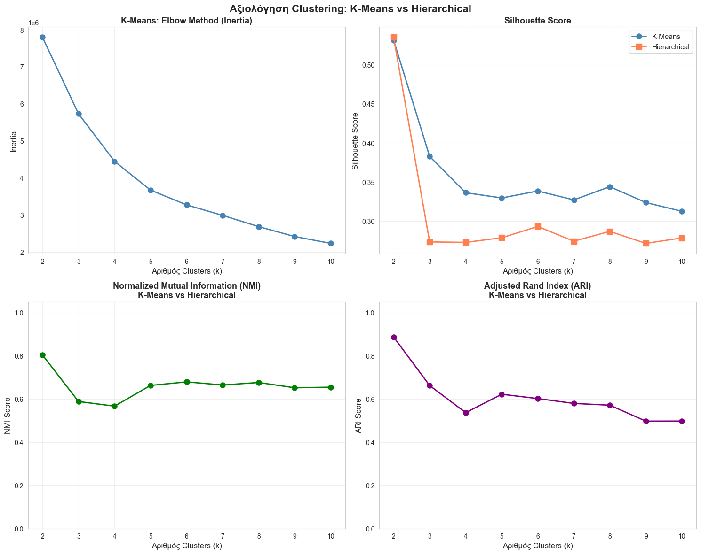
    *Εδώ παρατηρούμε χαμηλό διαχωρισμό.*

2.  **Step 2 (Scaling)**: Εφαρμογή scaling στις μεταβλητές.
    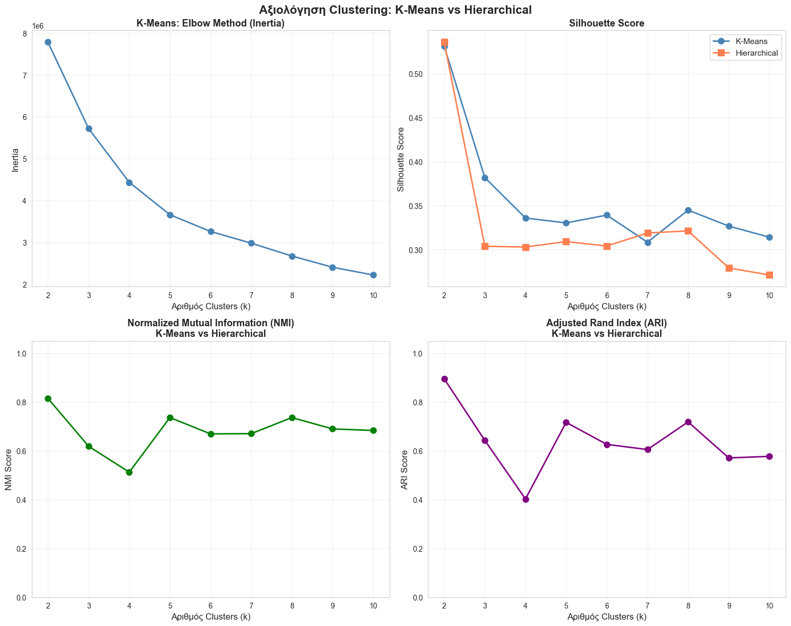
    *Δεν παρατηρήθηκε ουσιαστική βελτίωση στις μετρικές των Inertia & Sillhouette, παρά μονο στην συμφωνία των 2 αλγορίθμων με βαση την βελτίωση των NMI και ARI. Το scaling όμως αποτελει απαραίτητη διαδικασία για τον λόγο που έχει ηδη αναφερθεί.*

3.  **Step 3 (Categorical Removal)**: Αφαίρεση των κατηγορικών μεταβλητών που προέκυψαν από `type.of.meal` και `room.type` για μείωση θορύβου.
    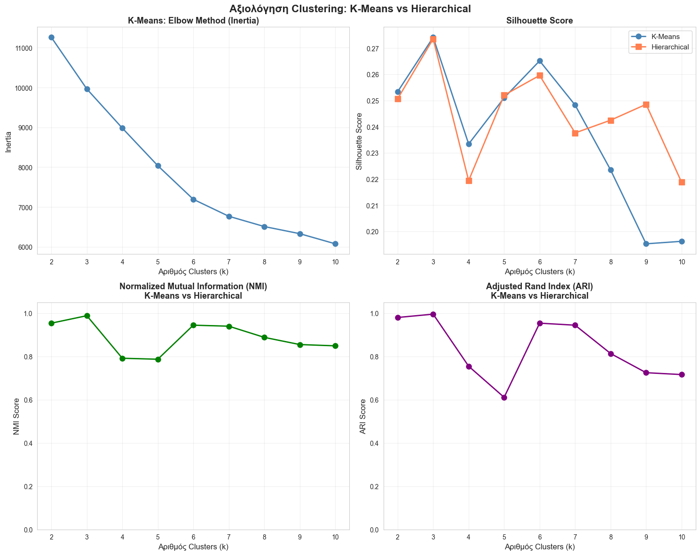
    *Η βελτίωση των metric του K-Means και του Hierarchical Clustering είναι σημαντική και η συμφωνία των 2 αλγορίθμων είναι πιο σταθερή.Βέβαια, το Inertia με elbow method υποστηρίζει οτι k=6, το Sillhouette υποστηρίζει k=4, αλλά και για k=6 είναι σχετικλα υψηλό το Sillhouette, ενώ το NMI και ARI υποστηρίζουν k=4, χωρίς να αποκλείουν και το k=6. Για να έχουμε λοιπόν μια πιο σαφή εικόνα, με stepwise θα πρέπει να αφαιρέσουμε κάποιον θόρυβο, να καλυτερέυσει το Sillhouette και οι υπόλοιπες μετρικές να γίνουν πιο σίγουρες για την επιλογή του βέλτιστου k.*

4.  **Step 4 (Temporal Removal)**: Αφαίρεση των μεταβλητών `arrival.year` και `date.of.reservation`.
    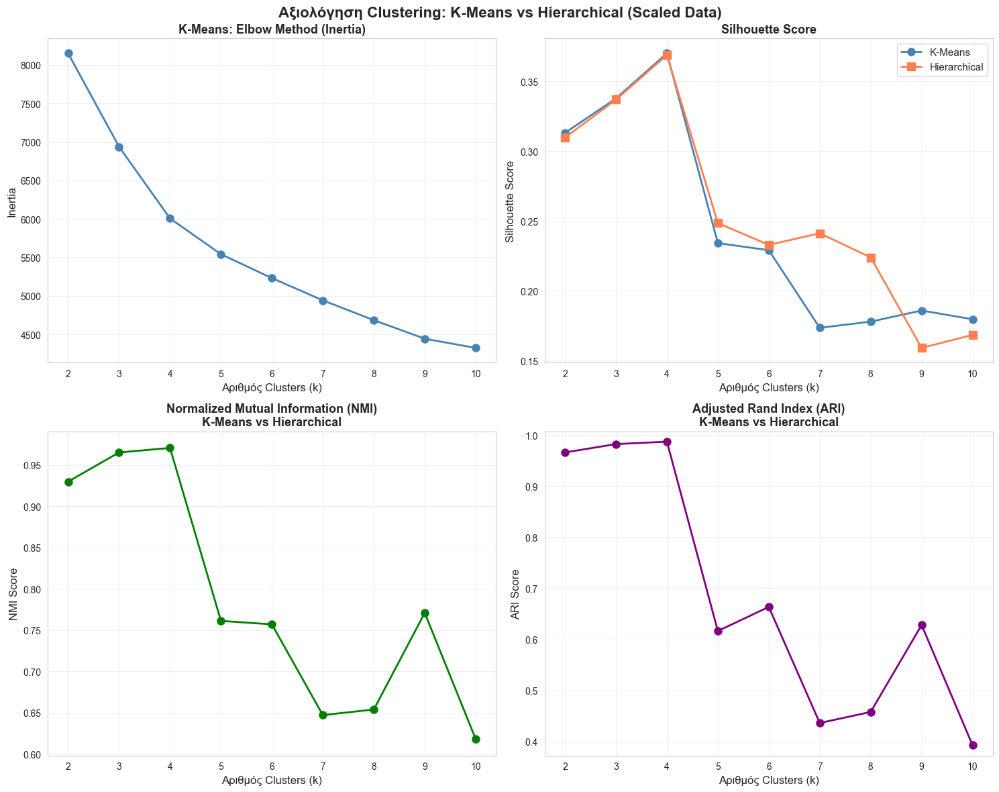
    *Η βελτίωση των metric του K-Means και του Hierarchical Clustering είναι σημαντική και η συμφωνία των 2 αλγορίθμων είναι πιο σταθερή. Η αφαίρεση των μεταβλητών `arrival.year` και `date.of.reservation` ανέβαζε το Silhouette περισσότερο από οποιαδήποτε άλλη μεταβλητή και η συμφωνία των 2 αλγορίθμων είναι πιο σταθερή. Πλέον, μπορούμε να υποστηρίξουμε με αρκετή σιγουριά οτι k=4. Παρόλαυτα, επειδή με stepwise βρήκαμε οτι αν αφαιρέσουμε το Arrival_Month θα καλυτερέυσει το Sillhouette κατα ~33%, δοκιμάζουμε και αυτό.*
    

5.  **Step 5 (Arrival_Month Removal)**:
    - **Παρατήρηση**: Οι μέσες τιμές του `Arrival_Month` σε όλα τα 4 clusters ήταν πολύ κοντά στο 6 (range: 6.41-6.67)
    - **Feature Elimination Analysis**: Η αφαίρεση του `Arrival_Month` ανέβαζε το Silhouette περισσότερο από οποιαδήποτε άλλη μεταβλητή
    - **Συμπέρασμα**: Το `Arrival_Month` είναι θόρυβος και δεν συμβάλλει στον διαχωρισμό των clusters
    - **Ενέργεια**: Αφαιρέθηκε το `Arrival_Month`
    
    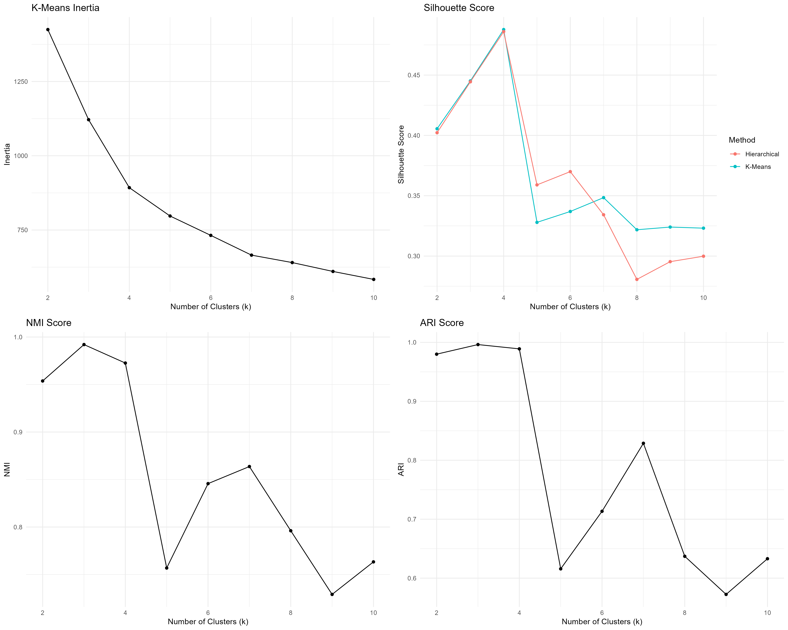
    *Η τελική μορφή όπου αναδείχθηκε το k=4 ως βέλτιστη λύση. Σχολιάζω παρακάτω τα αποτελέσματα του διαγράμματος*

### Σύγκριση Αλγορίθμων & Επιλογή Βέλτιστου k
Για να επιβεβαιώσουμε τη σταθερότητα των ομάδων, συγκρίναμε τα αποτελέσματα του K-Means με αυτά της Ιεραρχικής Ομαδοποίησης χρησιμοποιώντας τους δείκτες **NMI** και **ARI**.

| k | NMI | ARI | Σχόλια |
|---|---|---|---|
| 2 | 0.9537 | 0.570 | Υψηλή συμφωνία |
| **3** | **0.9920** | **0.9963** | **Εξαιρετικά μέγιστη συμφωνία - Βέλτιστη λύση** |
| **4** | **0.9726** | **0.9890** | **Πολύ υψηλή συμφωνία - Εξίσου σημαντική λύση** |
| 5 | 0.7569 | 0.6157 | Σημαντική πτώση στη συμφωνία |

Παρατηρούμε ότι για **k=3**, οι δείκτες NMI και ARI λαμβάνουν τις μέγιστες τιμές τους, υποδεικνύοντας ότι οι δύο αλγόριθμοι συμφωνούν σχεδόν απόλυτα σε αυτή τη λύση. Ωστόσο, η τελική επιλογή του **k=4** βασίστηκε στον συνδυασμό όλων των δεικτών:

1. **Inertia**: Η καμπύλη του Inertia εμφανίζει ξεκάθαρο "αγκώνα" στο k=4, υποδηλώνοντας ότι η προσθήκη της 4ης ομάδας μειώνει σημαντικά την διακύμανση εντός των clusters.
2. **Silhouette Score**: Λαμβάνει τη μέγιστη τιμή του στο **k=4** (~0.49), γεγονός που δείχνει ότι τα clusters είναι πιο καλά διαχωρισμένα και συμπαγή σε σχέση με το k=3(~0.44).
3. **Σταθερότητα**: Στο k=4, οι δείκτες NMI και ARI παραμένουν εξαιρετικά υψηλοί (> 0.98), επιβεβαιώνοντας ότι η λύση είναι σταθερή και κοινά αποδεκτή και από τους δύο αλγόριθμους.
4. **Πτώση στο k=5**: Για k=5, παρατηρούμε κατακόρυφη πτώση σε όλους τους δείκτες (Silhouette, NMI, ARI), καθιστώντας το k=4 την πιο ασφαλή, βέλτιστη και σίγουρη επιλογή.

**Τελικά Αποτελέσματα (k=4):**
- **Silhouette Score**: ~0.49 (Υψηλή ποιότητα)
- **NMI** = 0.9726 / **ARI** = 0.9890 (Εξαιρετική συμφωνία μεταξύ K-Means και Ιεραρχικής)

### Οπτική Επιβεβαίωση (Python Generated)
Για περαιτέρω επιβεβαίωση της δομής των δεδομένων, δημιουργήσαμε γραφήματα PCA και Dendrogram. Και στα δύο γραφήματα φαίνεται ξεκάθαρα η ύπαρξη 4 ομάδων.

**PCA Projection (K-Means k=4)**
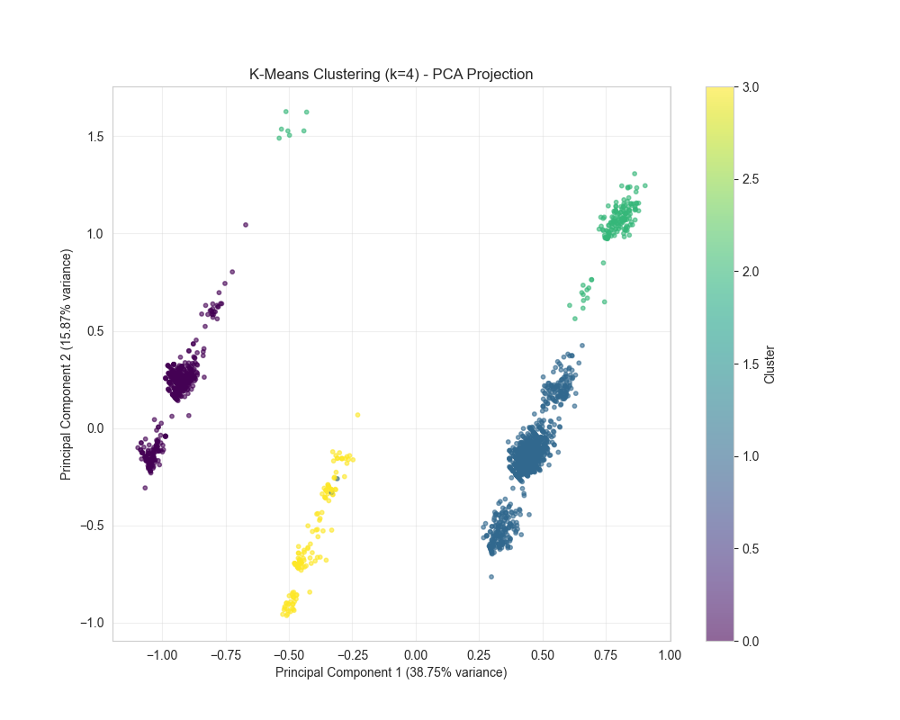
*Η προβολή PCA δείχνει ξεκάθαρα 4 διακριτές ομάδες, επιβεβαιώνοντας την επιλογή του k=4.*

**Hierarchical Clustering Dendrogram**
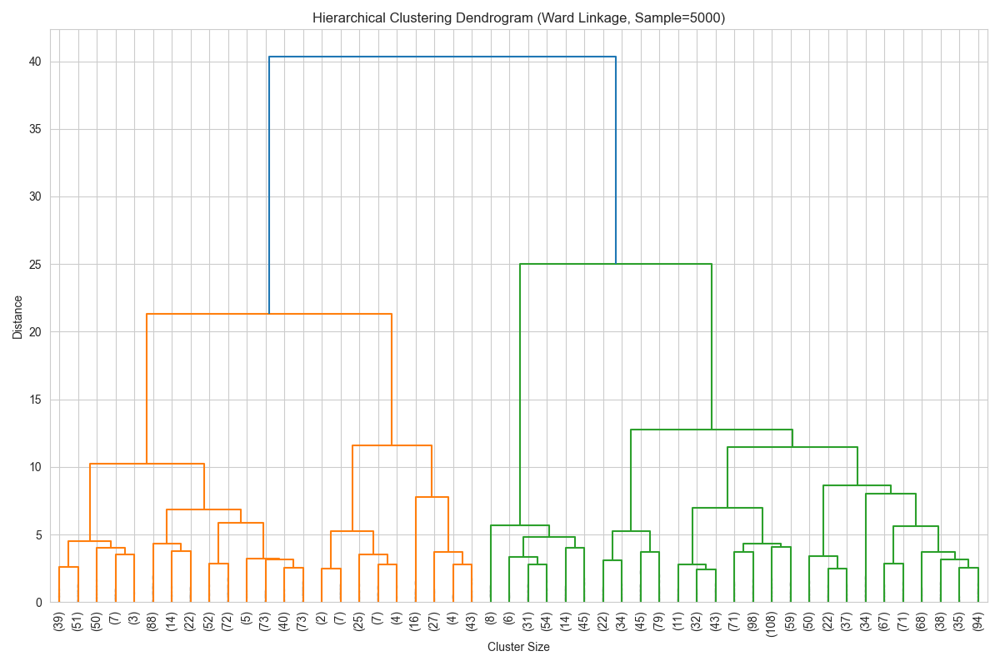
*Το δενδρόγραμμα υποδεικνύει επίσης μια φυσική διαίρεση σε 4 κύριους κλάδους.*

## 4. Cluster Visuals & Profiles

### Heatmap
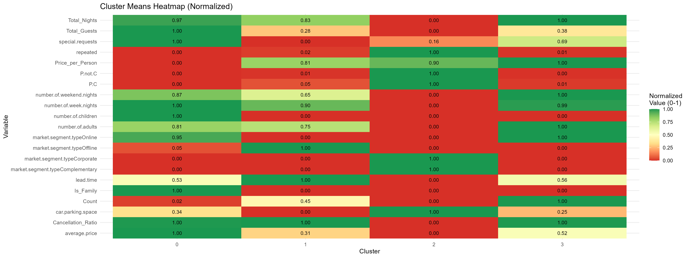
 
 
 
 
 
 

### Ποσοστά Ακυρώσεων
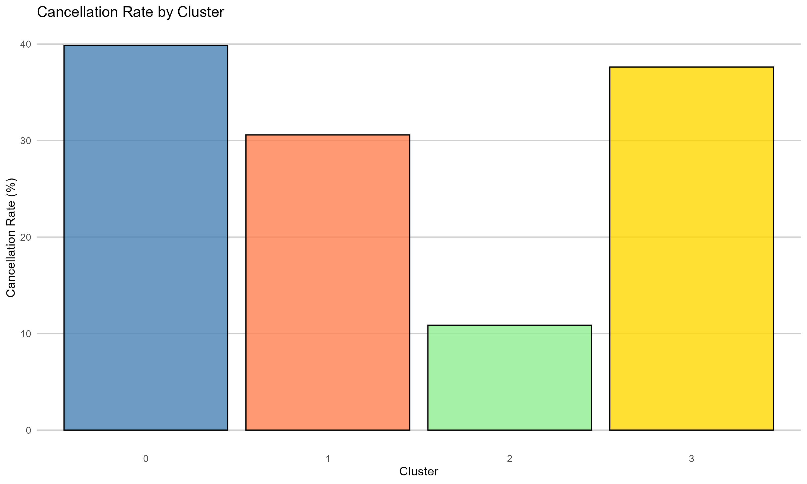

### Συγκρίσεις Ομάδων
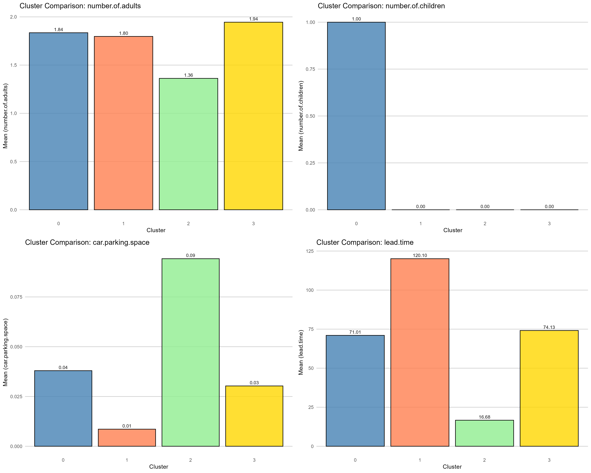
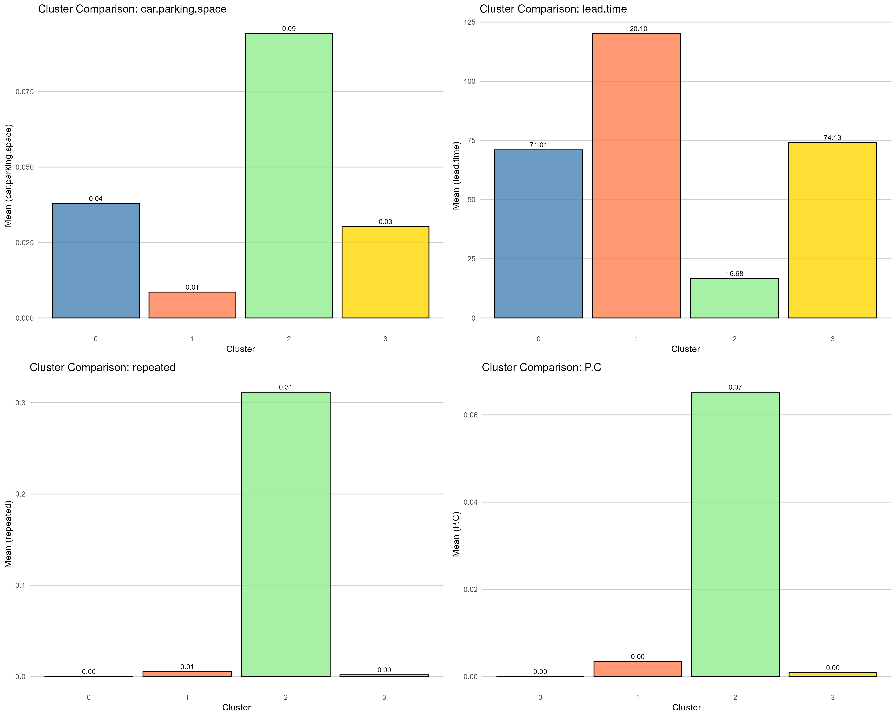
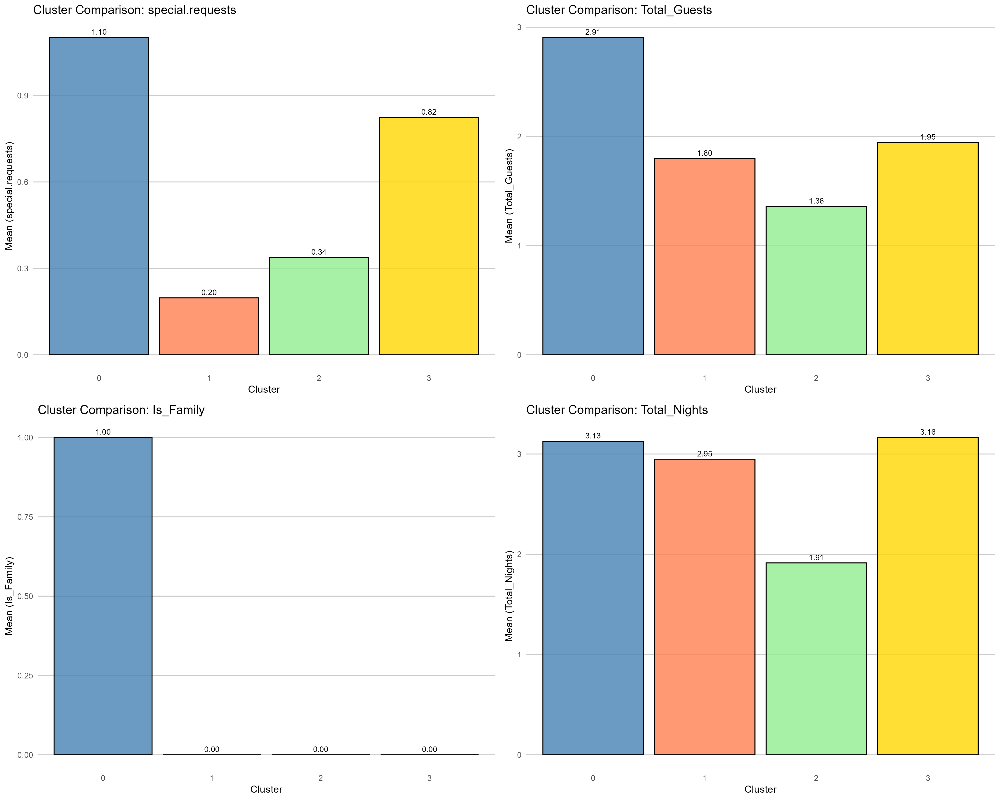
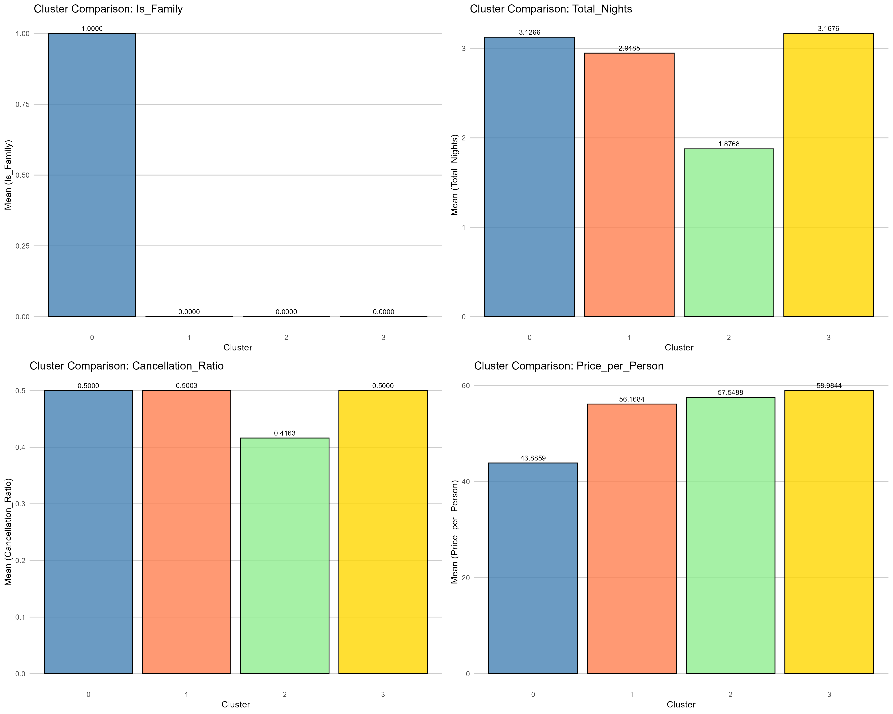

### Σύγκριση Market Segment ανά Cluster
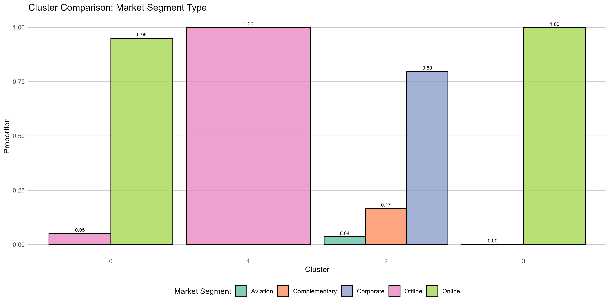

Με βάση την τελική ομαδοποίηση, εντοπίσαμε 4 διακριτά προφίλ πελατών.
Θα επιχειρήσουμε να τα ονοματοδοτήσουμε κατάλληλα και να τα παρατηρήσουμε. Για την επιβεβαίωση των βασικών χαρακτηριστικών των ομάδων, ανατρέξτε στο heatmap που βρίσκεται παραπάνω:
 
 

### Cluster 0: Premium Οικογένειες
- **Προφίλ**: Οικογένειες σε διακοπές.
- **Βασικά Χαρακτηριστικά**: Παρουσία **παιδιών**, υψηλότερη συνολική τιμή, τα περισσότερα ειδικά αιτήματα.
- **Κανάλι Κράτησης**: **Online**.
- **Ρίσκο**: Υψηλότερο ποσοστό ακύρωσης (~40%) λόγω πολυπλοκότητας του οικογενειακού ταξιδιού και των απροβλεπτων που μπορούν να προκύψουν για ένα μέλος της οικογένειας, το οποίο θα αναγκάσει ολόκληρη την οικογένεια να ακυρώσει.
- **Εξήγηση**: 
    - ***Απρόοπτα:*** Όταν ταξιδεύουν παιδιά, είναι πολύ συχνό να προκύψει μια ασθένεια ή αλλαγή προγράμματος τελευταία στιγμή.
    - ***Κόστος:*** Επειδή είναι η πιο ακριβή ομάδα (High Price), οι γονείς συχνά ψάχνουν μέχρι τελευταία στιγμή για καλύτερη προσφορά (deal hunting) και αν τη βρουν, ακυρώνουν την αρχική.
    - ***Lead Time:*** Οι οικογενειακές διακοπές οργανώνονται νωρίς, δίνοντας μεγάλο χρονικό περιθώριο για να πάει κάτι στραβά.

### Cluster 1: Παλίας σχολής
- **Προφίλ**: Ταξιδιώτες μεγαλύτερης ηλικίας ή γκρουπ που προγραμματίζουν πολύ νωρίτερα.
- **Βασικά Χαρακτηριστικά**: Μεγαλύτερος **χρόνος προετοιμασίας (Lead Time)**, χαμηλότερη μέση τιμή.
- **Κανάλι Κράτησης**: **Offline** (Ταξιδιωτικοί Πράκτορες/Τηλέφωνο).
- **Ρίσκο**: Μεσαίο-Υψηλό ποσοστό ακύρωσης (~30%).
- **Εξήγηση**: Είναι χαμηλότερο από το Cluster 0 γιατί η Offline κράτηση (τηλέφωνο/πρακτορείο) δημιουργεί μια δέσμευση. Δεν ακυρώνεις τόσο εύκολα όσο με ένα κλικ στο κινητό και δεν έχει συνήθως δωρεάν ακύρωση. Μπορεί να υπάρχει κάποιο πέναλτι. Παραμένει όμως υψηλό γιατί, όπως είδαμε στο Heatmap, έχουν το μεγαλύτερο Lead Time. Όταν κλείνεις μήνες πριν, η πιθανότητα να αλλάξουν τα σχέδιά σου είναι στατιστικά μεγάλη.

### Cluster 2: Πιστοί Εταιρικοί Πελάτες
- **Προφίλ**: Επαγγελματίες ταξιδιώτες και συχνοί επισκέπτες.
- **Βασικά Χαρακτηριστικά**: **Επαναλαμβανόμενοι** επισκέπτες, ιστορικό μη ακυρώσεων, ανάγκη για πάρκινγκ.
- **Κανάλι Κράτησης**: **Corporate**, Aviation, Complementary.
- **Ρίσκο**: Χαμηλότερο ποσοστό ακύρωσης (~11%).
- **Εξήγηση**: Αυτό είναι το πιο "λογικό" νούμερο. Όπως είδαμε, αυτή η ομάδα περιλαμβάνει εταιρικούς πελάτες και επαναλαμβανόμενους επισκέπτες. Οι επαγγελματίες ταξιδεύουν για συγκεκριμένο σκοπό (δουλειά) και σπάνια ακυρώνουν. Επίσης, οι "Repeaters" είναι πιστοί πελάτες που ξέρουν το ξενοδοχείο και δεν κάνουν δοκιμαστικές κρατήσεις για να τις ακυρώσουν μετά. Είναι η "σταθερά" του ξενοδοχείου.
- **Parking**: Η ανάγκη για πάρκινγκ είναι αυξημένη καθώς πολλοί εταιρικοί πελάτες μετακινούνται με εταιρικά οχήματα.

### Cluster 3: Τυπικά Ζευγάρια
- **Προφίλ**: Ζευγάρια που ταξιδεύουν για αναψυχή.
- **Βασικά Χαρακτηριστικά**: 2 ενήλικες, 0 παιδιά, υψηλή τιμή ανά άτομο.
- **Κανάλι Κράτησης**: Αποκλειστικά **Online**.
- **Ρίσκο**: Υψηλό ποσοστό ακύρωσης (~37%).
- **Εξήγηση**: Οι Online κρατήσεις (Booking, Expedia etc) έχουν συνήθως δωρεάν ακύρωση και γίνονται με ένα κλικ. Οι τουρίστες αναψυχής συχνά κλείνουν "για να έχουν κάτι σίγουρο" (backup booking, το εχω κάνει πάμπολες φορές) και συνεχίζουν να ψάχνουν. Αν βρουν κάτι φθηνότερο ή πιο κεντρικό, ακυρώνουν χωρίς δεύτερη σκέψη.

## 6. Συμπέρασμα

Η ανάλυση clustering αποκάλυψε επιτυχώς **4 διακριτά προφίλ πελατών** με σημαντικές διαφορές στη συμπεριφορά κράτησης και το ρίσκο ακύρωσης. Η μεθοδολογία που ακολουθήθηκε(συνδυασμός K-Means και Hierarchical Clustering με βηματική αφαίρεση θορυβωδών μεταβλητών) οδήγησε σε εξαιρετικά υψηλή συμφωνία μεταξύ των αλγορίθμων (NMI > 0.97, ARI > 0.98), επιβεβαιώνοντας την εγκυρότητα των αποτελεσμάτων.

### Βασικά Ευρήματα

1. **Ποιότητα Clustering**: Το τελικό Silhouette Score (~0.49) υποδεικνύει ισχυρό διαχωρισμό των ομάδων, ενώ η σταδιακή βελτίωση από 0.27 (αρχικά) σε 0.49 (τελικά) αποδεικνύει τη σημασία της προσεκτικής επιλογής χαρακτηριστικών.

2. **Διαφοροποίηση Ρίσκου**: Τα ποσοστά ακύρωσης κυμαίνονται από 11% (Corporate) έως 40% (Families), δημιουργώντας σαφείς κατηγορίες ρίσκου που επιτρέπουν στοχευμένες στρατηγικές.

3. **Κανάλι vs Ρίσκο**: Οι Online κρατήσεις (Clusters 0, 2) παρουσιάζουν σταθερά υψηλότερα ποσοστά ακύρωσης (37-40%) σε σχέση με Offline/Corporate (11-30%), υποδεικνύοντας τη σημασία του καναλιού κράτησης.

### Πρακτικές Εφαρμογές

Τα αποτελέσματα επιτρέπουν την ανάπτυξη **διαφοροποιημένων στρατηγικών** ανά cluster, για να αποτραπεί οσο το δυνατόν περισσότερο ο κίνδυνος των ακυρώσεων (δεν ζητείται απο εκφώνηση, αλλα παρατίθεται):

- **Cluster 3 (Corporate)**: Προτεραιότητα σε loyalty programs και εταιρικά πακέτα για διατήρηση αυτής της σταθερής βάσης εσόδων.
- **Clusters 0 & 2 (High Risk)**: Εφαρμογή μη επιστρεπτέων τιμών, προκαταβολών, ή ειδικών εκπτώσεων για early check-in/late cancellation.
- **Cluster 1 (Παλιάς σχολής)**: Στόχευση με early booking discounts για μετατροπή του μεγάλου lead time σε πλεονέκτημα.

### Τελική Παρατήρηση

Η ανάλυση αποδεικνύει ότι **το κανάλι κράτησης, η σύνθεση της ομάδας (οικογένεια vs ζευγάρι vs εταιρικό), και ο χρόνος προετοιμασίας** είναι οι κρισιμότεροι παράγοντες που καθορίζουν τη συμπεριφορά ακύρωσης. Αντίθετα, χαρακτηριστικά όπως `room.type`, `meal.type`, και `arrival.month` αποδείχθηκαν θόρυβος, υπογραμμίζοντας τη σημασία του feature selection στην ποιότητα του clustering.
